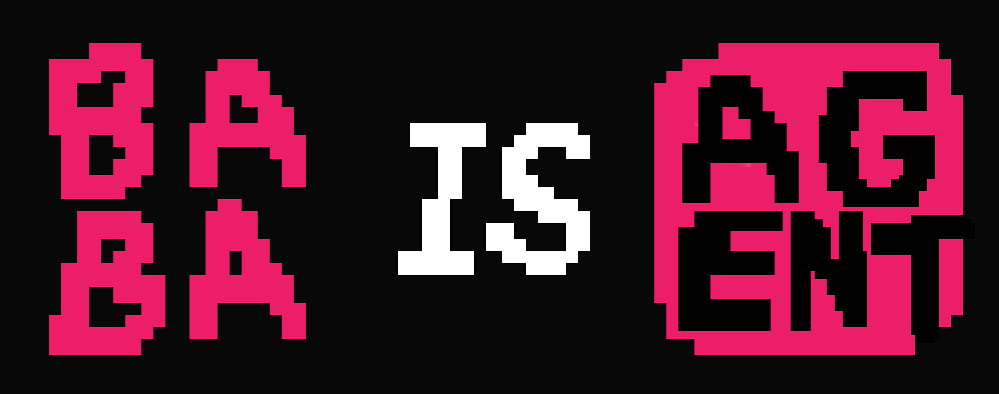

<div align="center">
  
</div>

# Baba Is Agent

Langgraph-based AI agent that plays the puzzle game *[Baba is You](https://store.steampowered.com/app/736260/Baba_Is_You/)*.

Inspired by the [baba_is_eval](https://github.com/lennart-finke/baba_is_eval) repository.

This serves as a playground for developing agents and exploring different approaches.

## Setup

Requires macOS with the Steam version of *Baba is You*.

1. Clone **baba_is_eval** to the game's `Data` directory (see [baba_is_eval](https://github.com/lennart-finke/baba_is_eval) for details). The agent requires the MCP server to run.

2. Install dependencies:
   ```bash
   python3 -m venv .venv
   source .venv/bin/activate
   pip install -e .[baba-mcp]
   ```

3. Create a `.env` file in the project root:
   ```env
   API_KEY=<your OpenAI API key>
   # Optional:
   MODEL=gpt-4
   BASE_URL=https://api.openai.com/v1
   ```

4. Start the game and enter a level.

5. Run the agent:
   ```bash
   python main.py
   ```

   This will launch the MCP server and start the agent loop to solve the current level.
